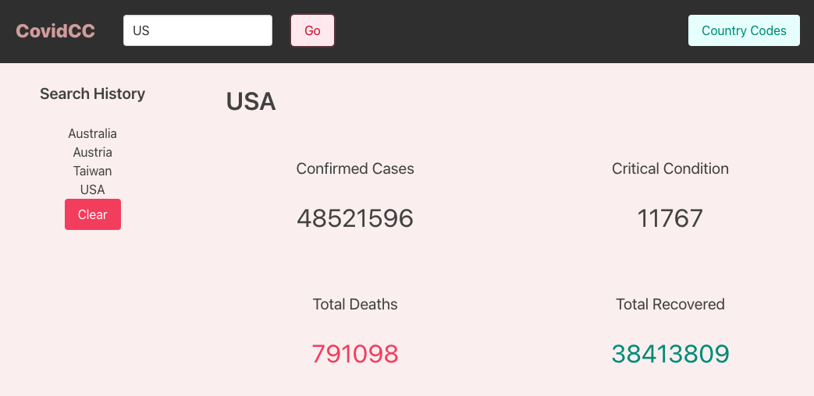

# CovidCountryData

## Description 

App to gather current data per country relating to Covid-19 statistics. Search by country code - list available by clicking on top right Country Code button - to display confirmed cases, critical condition, total deaths, and total recovered. Data gathered from [Covid-19Data](https://rapidapi.com/Gramzivi/api/covid-19-data/) API. 

## Table of Contents
* [Links](#links)
* [Technologies](#technologies)
* [Usage](#usage)
* [Screenshots](#screenshots)
* [Licenses](#licenses)

## Links 

* [LiveLink](https://stephanieheins.github.io/CovidCountryData/)
* Local: See [Usage](#Usage) for local setup instructions.

## Technologies

* HTML
* CSS/Bulma
* Javascript
* Covid-19 Data API

## Usage 

* Clone the repository 
* Open index.html in a browser 
* Search for a country by CC

## Screenshots

## Licenses 
MIT
